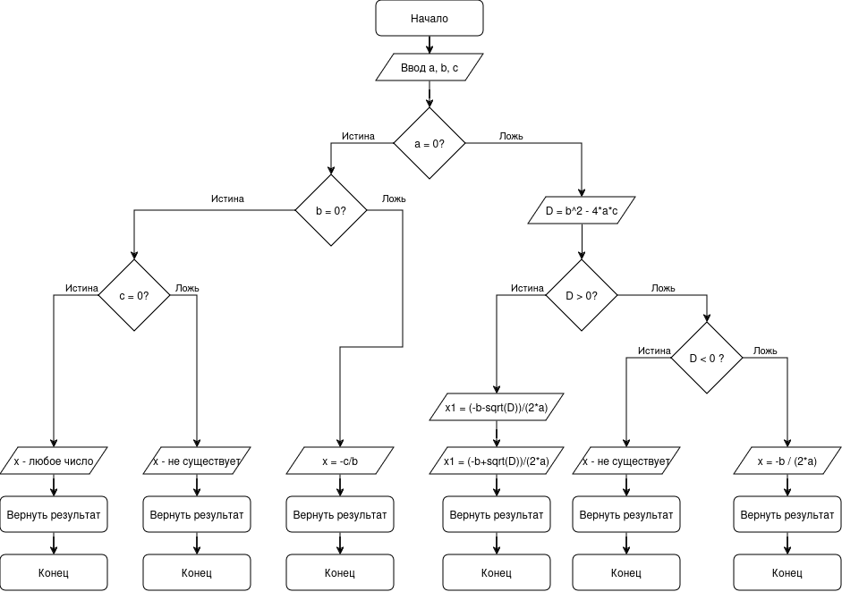
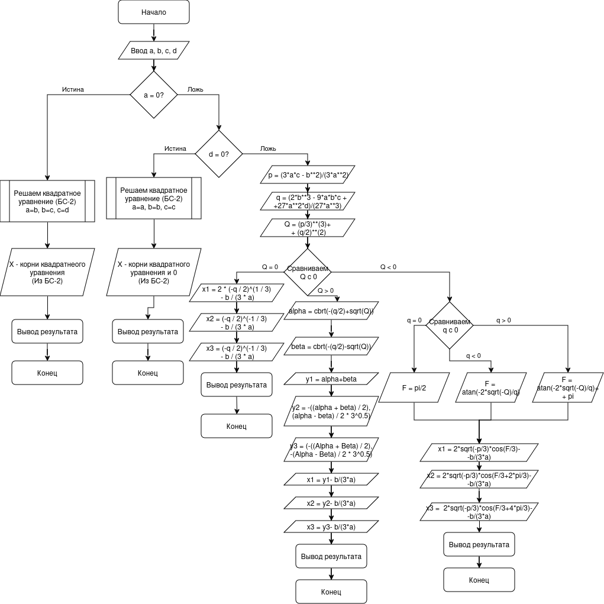

# MS-1
ИТМО, ФББТС, Моделирование систем, первая лабораторная работа.
## Блок схема решения квадратного уравнения

## Блок схема решения кубического уравнения

## Требования
Ubuntu linux 22.04 ИЛИ Manjaro (Тестировал на 5.10.178-1-MANJARO) с установленным docker актуальной версии
Возможна работа и на других дистрибутивах, но я не проверял
## Сборка
```docker compose build```
## Запуск
```docker compose up -d```
## Тестирование
Запустить unit-тесты из папки tests
